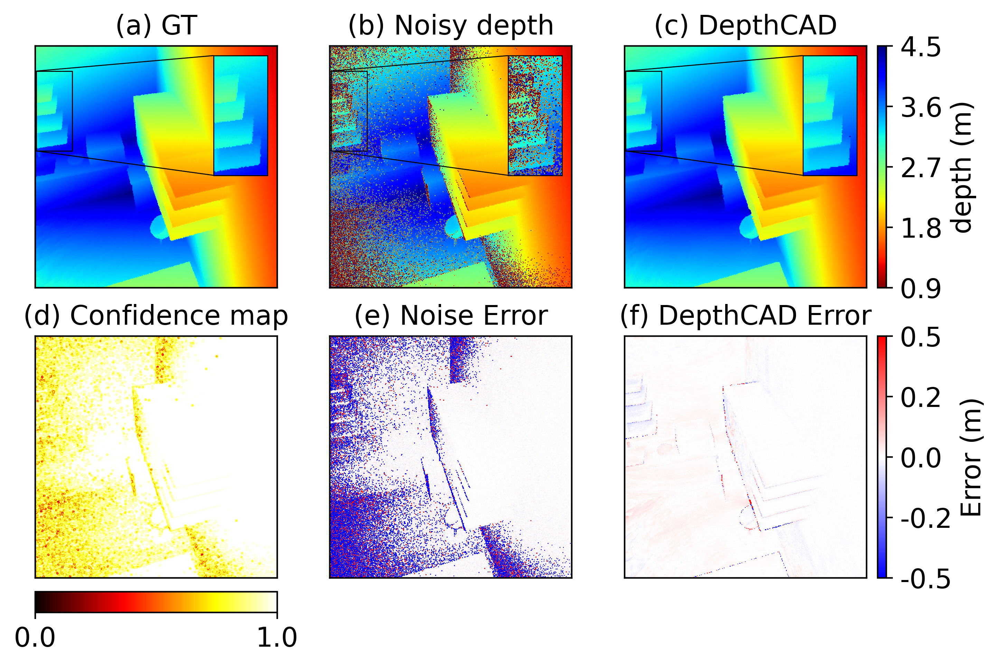

# DepthCAD: Depth Denoising with Confidence-Aware Diffusion model
A PyTorch implementation of Depth Denoising with Confidence-Aware Diffusion model.\

## Environment Setup
### Clone this directory
```
git clone https://github.com/BadbeardHe/DepthCAD.git
```
### Install Dependencies
Ensure your environment has Python 3.9 or later installed. Use the following command to install required dependencies:
```
pip install -r requirements.txt
```

Initialize an Accelerate environment with:
```
accelerate config
```

## Dataset Preparation
1. Download [FLAT dataset](https://github.com/NVlabs/FLAT.git). 
2. Run `flat_dataset/preprocess.py` to generate low-dynamic-range IQs and confidence files.  
3. Create a train.jsonl file in the `/flat_dataset` directory with the following format:
    ```
    {"idx": "FILE_ID", "text": ""}
    ```

## Basic Usage
### Training
Run the following command to start model training:
```
accelerate launch train.py \
    --pretrained_model_name_or_path "/Path/to/Stable/Diffusion/model" \
    --output_dir "/Path/to/trained/DepthCAD/models/directory" \
    --dataset_name="flat_dataset" \
    --mixed_precision="fp16" \
    --resolution=512 \
    --learning_rate=1e-4 \
    --train_batch_size=16 \
    --gradient_accumulation_steps=4 \
    --gradient_checkpointing \
    --use_8bit_adam \
    --enable_xformers_memory_efficient_attention \
    --set_grads_to_none \
    --num_train_epochs=500 \
    --lr_scheduler="cosine" \
    --checkpointing_steps 50
```

### Inferencing
Run the following command to inference a single scene:
```
python inference.py \
    --pretrained_model_name_or_path "/Path/to/Stable/Diffusion/model" \
    --depthcad_path "/Path/to/trained/DepthCAD/model" \
    --noise_IQ_file "/Path/to/noise/IQ/file" \
    --noise_depth_file "/Path/to/noise/depth/file" \
    --out_file "/Path/to/predicted/depth"
```

### Evaluation
Evaluate trained model using the command:
```
python eval.py \
    --test_list_path "/Path/to/test/list" \
    --out_dir "/Path/to/result/dir" \
    --pred_dir "/Path/to/predicted/depth/dir"
```

# References
If you find this repository useful for your research, please cite the following work.
```
@inproceedings{he2025towards,
  title={Towards Robust Time-of-Flight Depth Denoising with Confidence-Aware Diffusion Model},
  author={He, Changyong and Zeng, Jin and Zhang, Jiawei and Guo, Jiajie},
  booktitle={2025 IEEE International Conference on Multimedia and Expo (ICME)},
  pages={1--6},
  year={2025},
  organization={IEEE}
}
```